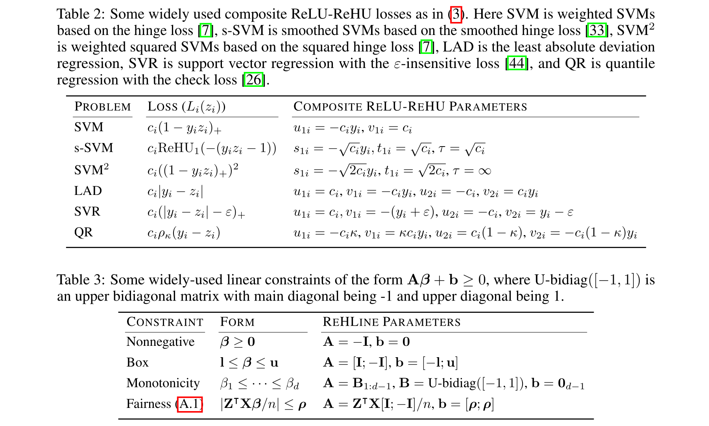

# ReHLine <a href="https://github.com/softmin/ReHLine-r"></a>

**ReHLine** is designed to be a computationally efficient and practically useful software package for large-scale empirical risk minimization (ERM) problems.

The **ReHLine** solver has four appealing
"linear properties":

- It applies to any convex piecewise linear-quadratic loss function, including the hinge loss, the check loss, the Huber loss, etc.
- In addition, it supports linear equality and inequality constraints on the parameter vector.
- The optimization algorithm has a provable linear convergence rate.
- The per-iteration computational complexity is linear in the sample size.

We develop both [Python](https://github.com/softmin/ReHLine-python)
and [R](https://github.com/softmin/ReHLine-r) interfaces to the
**ReHLine** solver, and the core algorithm is implemented
in efficient C++ code.
This repository provides the `rehline` R package.

## 📮 Formulation

**ReHLine** is designed to address the empirical regularized ReLU-ReHU minimization problem, named *ReHLine optimization*, of the following form:
```math
\min_{\mathbf{\beta} \in \mathbb{R}^d} \sum_{i=1}^n \sum_{l=1}^L \text{ReLU}( u_{li} \mathbf{x}_i^\intercal \mathbf{\beta} + v_{li}) + \sum_{i=1}^n \sum_{h=1}^H {\text{ReHU}}_{\tau_{hi}}( s_{hi} \mathbf{x}_i^\intercal \mathbf{\beta} + t_{hi}) + \frac{1}{2} \| \mathbf{\beta} \|_2^2, \qquad \text{ s.t. } \mathbf{A} \mathbf{\beta} + \mathbf{b} \geq \mathbf{0},
```
where $\mathbf{U} = (u_{li}),\mathbf{V} = (v_{li}) \in \mathbb{R}^{L \times n}$ and $\mathbf{S} = (s_{hi}),\mathbf{T} = (t_{hi}),\mathbf{\tau} = (\tau_{hi}) \in \mathbb{R}^{H \times n}$ are the ReLU-ReHU loss parameters, and $(\mathbf{A},\mathbf{b})$ are the constraint parameters.
The ReLU and ReHU functions are defined as $\mathrm{ReLU}(z)=\max(z,0)$ and
```math
\mathrm{ReHU}_\tau(z) =
  \begin{cases}
  \ 0,                     & z \leq 0 \\
  \ z^2/2,                 & 0 < z \leq \tau \\
  \ \tau( z - \tau/2 ),   & z > \tau
  \end{cases}.
```

This formulation has a wide range of applications spanning various fields, including statistics, machine learning, computational biology, and social studies. Some popular examples include SVMs with fairness constraints (FairSVM), elastic net regularized quantile regression (ElasticQR), and ridge regularized Huber minimization (RidgeHuber).



## Basic usage

The usage of the `rehline` R package is very straightforwawrd.
For general ReHLine optimization problems, simply specify the
corresponding matrices in the `rehline()` function, or set
some of them to `NULL` if they are not used. For example:

```r
library(rehline)
set.seed(123)
n = 500
d = 10
L = 5
H = 4
m = 3

Xmat = matrix(rnorm(n * d), n, d)
Umat = matrix(rnorm(L * n), L, n)
Vmat = matrix(rnorm(L * n), L, n)
Smat = matrix(rnorm(H * n), H, n)
Tmat = matrix(rnorm(H * n), H, n)
Tau = Inf
Amat = matrix(rnorm(m * d), m, d)
bvec = rnorm(m)

res = rehline(
    Xmat, Umat, Vmat, Smat, Tmat, Tau, Amat, bvec,
    max_iter = 1000, tol = 1e-3, verbose = 0
)
print(res$beta)
## [1] -0.032638926 -0.029052500  0.021690510  0.004606850 -0.015769712
## [6]  0.002429307  0.008920372  0.051252755 -0.023877601 -0.013258638

res = rehline(
    Xmat, Umat = NULL, Vmat = NULL,
    Smat = Smat, Tmat = Tmat, Tau = Tau,
    Amat = NULL, bvec = NULL,
    max_iter = 1000, tol = 1e-3, verbose = 0
)
print(res$beta)
## [1] -0.051807571 -0.049215902 -0.052786551 -0.002927573 -0.040757982
## [6]  0.043229483 -0.039403712 -0.007757519 -0.025120729 -0.021587389
```

The `rehline` package also provides some functions to directly fit
models on data sets. For example, the code below fits an SVM using
the `svm()` function, and compares the result with the `LiblineaR` package.

```r
library(rehline)
library(LiblineaR)

# Simulate a data set
set.seed(123)
n = 5000
p = 100
x1 = matrix(rnorm(n / 2 * p, -0.25, 0.1), n / 2)
x2 = matrix(rnorm(n / 2 * p, 0.25, 0.1), n / 2)
x = rbind(x1, x2)
beta = 0.1 * rnorm(p)
prob = plogis(c(x %*% beta))
y = 2 * rbinom(n, 1, prob) - 1
C = 0.5

# Compute using ReHLine
system.time(
    res1 <- svm(x, y, C = C * n, max_iter = 1000,
        tol = 1e-3, verbose = 0)
)
##   user  system elapsed
##  0.010   0.001   0.011
beta1 = res1$beta
head(beta1)
## [1]  0.61322066 -0.93920265  0.07600151  0.03649106  0.42362796 -0.54425647

# Compare the result with LiblineaR
system.time(
    res2 <- LiblineaR(x, y, type = 3, cost = C, epsilon = 1e-3,
        bias = 0, verbose = FALSE)
)
##   user  system elapsed
##  0.150   0.002   0.152
beta2 = as.numeric(res2$W)
head(beta2)
## [1]  0.6155191 -0.9444753  0.0734169  0.0397688  0.4258707 -0.5430257
```

## 📚 Benchmark (powered by benchopt)

Some existing problems of recent interest in statistics and machine
learning can be solved by **ReHLine**, and we provide reproducible
benchmark code and results at the
[ReHLine-benchmark](https://github.com/softmin/ReHLine-benchmark) repository.

| Problem   |      Results      |
|---------- |:-----------------:|
|[SVM](https://github.com/softmin/ReHLine-benchmark/tree/main/benchmark_SVM) | [Result](#)|
|[Smoothed SVM](https://github.com/softmin/ReHLine-benchmark/tree/main/benchmark_sSVM) | [Result](#)|
|[FairSVM](https://github.com/softmin/ReHLine-benchmark/tree/main/benchmark_FairSVM) | [Result](#)|
|[ElasticQR](https://github.com/softmin/ReHLine-benchmark/tree/main/benchmark_QR) | [Result](#)|
|[RidgeHuber](https://github.com/softmin/ReHLine-benchmark/tree/main/benchmark_Huber) | [Result](#)|
